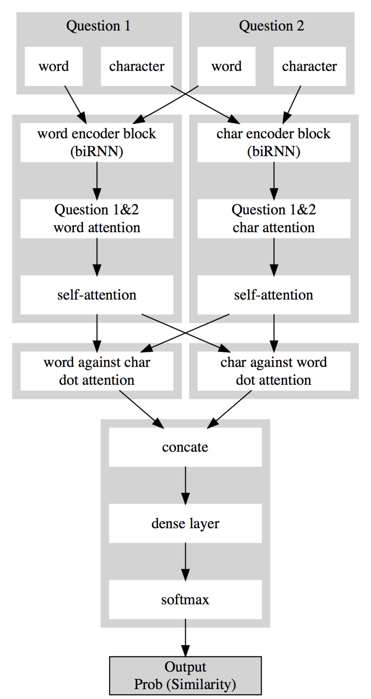

# QDD_Net: Duplicate Question Detector 

## Introduction
We propose the **QDD_Net**, which is used for duplicate question detection.  
Our model achieves a good performance in [PPDAI Magic Mirror Data Application Contest](https://ai.ppdai.com/mirror/goToMirrorDetail?mirrorId=1&tabindex=2).

## Data
Data should be pairs of questions labeled with 0 and 1 represents similar or not.  
Word & Character embedding should be provided respectively for representing the question sequences.

## Model
We proposed three models including a RNN based model, CNN based model and a RCNN based model. These models have the following characteristics:  

1. Bi-Directional GRU in RNN based models for semantic learning.
2. 1-D Convolution in CNN and RCNN based models for local feature extraction.
3. Co-Attention was used to learn the semantic correlations between two sequences.
4. Self-Attention was used to enhance the feature representation.
5. Word embedding and Character Embedding were used simultaneously.

## Architecture:

## Performance:
The ensemble model achieved 0.203930 for similarity loss in PPDAI contest, at the top 15% in ranking.

## Reference
[QANet: Combining Local Convolution with Global Self-Attention for Reading Comprehension[ICLR 2018]](https://arxiv.org/abs/1804.09541)  

[Zhouhan Lin et al. “A Structured Self-attentive Sentence Embedding”. In:CoRRabs/1703.03130 (2017).arXiv:1703.03130.](http://arxiv.org/abs/1703.03130.)  

[ Pranav Rajpurkar et al. “SQuAD: 100, 000+ Questions for Machine Comprehension of Text”. In:CoRRabs/1606.05250 (2016). arXiv:1606.05250.](http://arxiv.org/abs/1606.05250.)  

[Wenhui Wang et al. “Gated Self-Matching Networks for Reading Comprehension and Question Answering”](http://www.aclweb.org/anthology/P17-1018)  
